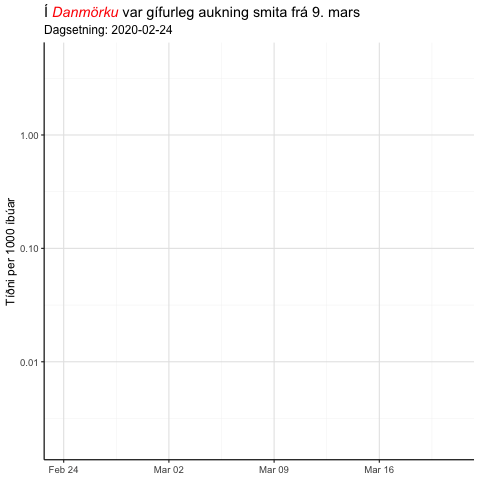

```{r setup, include=FALSE}
knitr::opts_chunk$set(echo = FALSE, warning = F, message = F, fig.asp = 0.621, out.width = "100%", fig.width = 8)
```


```{r}
library(tidyverse); library(cowplot); library(kableExtra); library(scales); library(gganimate)
library(lubridate); library(ggtext)
theme_set(theme_classic(base_size = 12) + 
              background_grid(color.major = "grey90", 
                              color.minor = "grey95", 
                              minor = "xy", major = "xy") +
              theme(legend.position = "none"))
```

```{r}
d <- read_csv("../Input/ECDC_Data.csv")
```

# Danir loka landamærum

***

Þann 13. mars var tilkynnt að Danmörk skyldi loka landamærum sínum frá og með hádegi daginn eftir, eða 14. mars. Af hverju? Hvaða áhrif hafði það? 

Við sjáum á myndinni að það var alveg gífurleg aukning smita í Danmörku. Við sjáum líka að eftir lokun landamæra hægðist mikið á þessari aukningu smitafjölda. Áhugasöm geta borið saman hlutfallslega aukningu smita á höfðatölu í **Aukning** flipanum.

```{r, eval = F}
p <- d %>% 
    filter(continent == "Europe", case_rate >= 0.002) %>% 
    ggplot(aes(date, case_rate, group = country, colour = country == "Denmark",
               size = country == "Denmark")) +
    geom_line(size = 1, aes(size = country == "Denmark")) +
    geom_vline(data = tibble(date = ymd("2020-03-14")),
               aes(xintercept = date), lty = 2, col = "red", inherit.aes = F) +
    geom_text(data = tibble(date = ymd("2020-03-14"),
                            y = 1.5, label = "Landamærum lokað"),
              aes(x = date, y = y, label = label),
              col = "red", size = 4, inherit.aes = F, nudge_x = 4.4) +
    scale_y_log10() +
    scale_colour_manual(values = c("grey", "red")) +
    scale_size_manual(values = c(1, 10)) +
    labs(title = "Í <i style='color:red'>Danmörku</i> var gífurleg aukning smita frá 9. mars",
         subtitle = "Dagsetning: {frame_along}",
         y = "Tíðni per 1000 íbúar") +
    theme(plot.title = element_markdown(), axis.title.x = element_blank())  +
    transition_reveal(date)
anim_save("denmark_borders.gif", p)
```

```{r, out.width = "50%", fig.align='center'}

```

