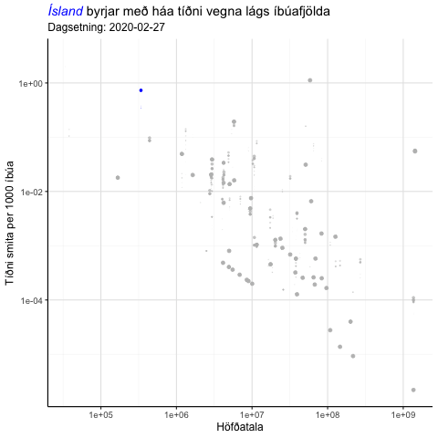

```{r setup, include=FALSE}
knitr::opts_chunk$set(echo = FALSE, warning = F, message = F, fig.asp = 0.621, out.width = "100%", fig.width = 8)
```


```{r}
library(tidyverse); library(cowplot); library(kableExtra); library(scales); library(gganimate)
library(lubridate); library(ggtext)
theme_set(theme_classic(base_size = 12) + 
              background_grid(color.major = "grey90", 
                              color.minor = "grey95", 
                              minor = "xy", major = "xy") +
              theme(legend.position = "none"))
```

```{r}
d <- read_csv("../Input/ECDC_Data.csv")
```

```{r, eval = F}
p <- d %>% 
    filter(date >= ymd("2020-02-27")) %>%
    ggplot(aes(pop, case_rate, col = country == "Iceland", group = country)) +
    geom_point() +
    scale_x_log10() +
    scale_y_log10() +
    scale_colour_manual(values = c("grey", "blue")) +
    labs(x = "Höfðatala", y = "Tíðni smita per 1000 íbúa",
         title = "<i style='color:blue'>Ísland</i> byrjar með háa tíðni vegna lágs íbúafjölda",
         subtitle = "Dagsetning: {closest_state}") +
    theme(legend.position = "none",
          plot.title = element_markdown()) +
    transition_states(date,
                      transition_length = 2,
                      state_length = 1) +
    shadow_wake(wake_length = 0.5)
anim_save("pop_growth.gif", p)
```

# Lögmál smárra talna

***

Ein frægasta niðurstaða tölfræðinnar er **lögmál stórra talna**. Samkvæmt því stefnir summa slembinna stærða á normaldreifingu í óendanleikanum *(þegar ákveðnum skilyrðum er uppfyllt)*. Stundum tala tölfræðingar í háði um **lögmál smárra talna**. 

Það er í rauninni *ekki lögmál*, heldur útskýring á því af hverju bæði hæstu og lægstu krabbameinstíðnina í Bandaríkjunum er oftast að finna í litlum bæjum. Það er hreinlega vegna þess að ef fáir íbúar eru í bæ þá mun eitt tilfelli hækka tíðnina gífurlega mikið. Sömuleiðis, ef fáir búa á staðnum, getur vel verið að enginn þjáist af krabbameini og því mælist tíðnin mjög lág! 

Við sjáum **lögmál smárra talna** skýrt í gögnum um útbreiðslu COVID-19 um heiminn, en mörg löndin með hæstu tíðni smita eru lönd eins og Ísland, San Marino og Liechtenstein. Við sjáum á myndinni að neðan að Ísland byrjar strax með mjög háa tíðni smita. Að miklum hluta er það vegna lágs íbúafjölda.


```{r, out.width = "70%", fig.align = "center"}

```

