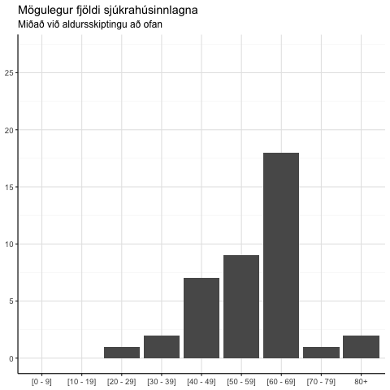

```{r setup, include=FALSE}
knitr::opts_chunk$set(echo = TRUE, warning = F, message = F, fig.asp = 0.621, out.width = "100%", fig.width = 7)
```


```{r}
library(tidyverse); library(cowplot); library(kableExtra); library(scales); library(gganimate)
library(lubridate); library(emmeans); library(broom); library(propagate)
theme_set(theme_classic(base_size = 12) + 
            background_grid(color.major = "grey90", 
                            color.minor = "grey95", 
                            minor = "xy", major = "xy") +
            theme(legend.position = "none"))
select <- dplyr::select
```

```{r}
d <- read_csv("../Data/smit.csv") %>% 
  filter(tegund == "Samtals",
         fjoldi > 0)
preds_cumulative <- read_csv("../Data/preds_cumulative.csv")
preds_active <- read_csv("../Data/preds_active.csv")
```

```{r}
preds_cumulative  %>% 
  mutate(dags = min(d$dags) + dagar -1) %>% 
  ggplot(aes(dags, pred)) +
  geom_line() +
  geom_line(aes(y = upper), lty = 2) +
  geom_point(data = d, aes(dags, fjoldi)) +
  labs(title = "Forspáð þróun í uppsöfnuðum smitafjölda",
       subtitle = "Besta mat (llína) auk efri marka (brotin lína)") +
  theme(axis.title = element_blank()) +
  ggsave("Myndir/Heild/syktir.png", width = 8, height = 0.621 * 8, scale = 1.5)
```

```{r}
preds_active  %>% 
  mutate(dags = min(d$dags) + dagar -1) %>% 
  ggplot(aes(dags, pred)) +
  geom_line() +
  geom_line(aes(y = upper), lty = 2) +
  geom_point(data = d, aes(dags, fjoldi)) +
  labs(title = "Forspáð þróun fjölda smita hverju sinni",
       subtitle = "Miðað við að einstaklingur hefur jafnað sig þremur vikum eftir greiningu") +
  theme(axis.title = element_blank()) +
  ggsave("Myndir/Heild/active_syktir.png", width = 8, height = 0.621 * 8, scale = 1.5)
```

# Herma

Gagnataflan að neðan er sett saman með

`p_tilfelli`: aldursdreifing smita skv [covid.is](covid.is). Bæti við einu tilfelli í alla aldurshópa til að leyfa smit í 80+ og jafna aðeins út drefinguna.

`p_spitali` og `p_alvarlegt`: [table 1 héðan](https://www.imperial.ac.uk/media/imperial-college/medicine/sph/ide/gida-fellowships/Imperial-College-COVID19-NPI-modelling-16-03-2020.pdf?fbclid=IwAR2jkFkpT583W2vFnbYNzHE539Gj6dzKvAVVfT0Tkyg8TEilNuUkW7V0yzk)

```{r}
aldur <- read_csv("../Data/aldur.csv")
aldur %>% 
  mutate_at(vars(starts_with("p_")), percent) %>% 
  set_names(c("Aldur", "Tilfelli á Íslandi", "% Tilfella", "% Spítali", "% Alvaregt")) %>% 
  kable(align = c("l", rep("c", 4)),
        caption = "Tafla 1. Aldursdreifing tilfella á Íslandi og vænt hlutföll fyrir spítala") %>% 
  kable_styling(bootstrap_options = c("striped", "hover")) %>% 
  add_header_above(c("Íslenskar upplýsingar" = 3, "Úr rannsóknum" = 2)) %>% 
  footnote(general = c("Einu tilviki bætt við alla aldurshópa til að jafna út dreifingu og leyfa smit í 80+"))
```


Skref í hermun:

1) Met logistic growth líkan og fæ forspá úr því, mean og 97.5% predictive upper limit
2) Nota fyrirliggjandi aldursdreifingu smita og forspár til að herma framtíðartilfelli með multinomial (bætti einu tilviki við alla aldurshópa til að fá ekki 0 í 80+)
3) Nota [table 1 héðan](https://www.imperial.ac.uk/media/imperial-college/medicine/sph/ide/gida-fellowships/Imperial-College-COVID19-NPI-modelling-16-03-2020.pdf?fbclid=IwAR2jkFkpT583W2vFnbYNzHE539Gj6dzKvAVVfT0Tkyg8TEilNuUkW7V0yzk) til að herma sjúkahúslegur út frá skiptingu tilfella
4) Nota sömu töflu til að spá fyrir um bráð tilfelli meðal ofangreinda sjúkrahúsinnlagna
5) Sæki miðgildi og valið quantile úr öllum ofangreindum hermunum og skila í gagnatöflu.

#### Skipta í aldurshópa

```{r, out.width = "60%", fig.align="center"}
knitr::include_graphics("skipta_i_hopa.gif")
```

#### Herma fjölda innlagna

```{r}
set.seed(1)
cases <- rmultinom(n = 1, size = 600, prob = aldur$p_tilfelli) %>% as.vector
plot_d <- aldur %>% 
  select(aldur, p_spitali) %>% 
  mutate(cases = cases)
plot_d %>% 
  select(Aldur = aldur, Smit = cases) %>% 
  kable(caption = "Möguleg skipting í aldurshópa miðað við 600 heildarsmit",
        align = c("l", "c")) %>% 
  kable_styling(full_width = F, bootstrap_options = c("striped", "hover")) %>% 
  column_spec(1:2, width = "5cm")
```

```{r, out.width = "60%", fig.align='center'}

```


```{r}
make_pred <- function(estimate, upper, aldur, n = 1000, q = 0.95) {
  cases_est <- rmultinom(n = n, size = estimate, prob = aldur$p_tilfelli)
  cases_upper <- rmultinom(n = n, size = upper, prob = aldur$p_tilfelli)
  
  rows <- nrow(cases_est)
  cols <- ncol(cases_est)
  
  hospital_est <- matrix(0, nrow = rows, ncol = cols)
  hospital_upper <- matrix(0, nrow = rows, ncol = cols)
  serious_est <- matrix(0, nrow = rows, ncol = cols)
  serious_upper <- matrix(0, nrow = rows, ncol = cols)
  
  for (i in seq_len(cols)) {
    hospital_est[, i] <- rbinom(rows, size = cases_est[, i], prob = aldur$p_spitali)
    serious_est[, i] <- rbinom(rows, size = hospital_est[, i], prob = aldur$p_alvarlegt)
    
    hospital_upper[, i] <- rbinom(rows, size = cases_upper[, i], prob = aldur$p_spitali)
    serious_upper[, i] <- rbinom(rows, size = hospital_upper[, i], prob = aldur$p_alvarlegt)
    
  }
  
  
  median_cases <- apply(cases_est, 1, median)
  upper_cases <- apply(cases_upper, 1, quantile, probs = q)
  
  median_hospital <- apply(hospital_est, 1, median)
  upper_hospital <- apply(hospital_upper, 1, quantile, prob = q)
  
  median_serious <- apply(serious_est, 1, median)
  upper_serious <- apply(serious_upper, 1, quantile, prob = q)
  
  tibble(aldur = aldur$aldur,
         median_cases = median_cases,
         upper_cases = upper_cases,
         median_hospital = median_hospital,
         upper_hospital = upper_hospital,
         median_serious = median_serious,
         upper_serious = upper_serious) %>% 
    list
}
```


```{r}
if (!file.exists("simulations.csv")) {
  simulations <- preds %>% 
    rowwise %>% 
    mutate(simulation = make_pred(pred, upper, aldur, n = 20000)) %>% 
    unnest(simulation) %>% 
    mutate(dags = dagar + min(d$dags)) %>% 
    pivot_longer(c(starts_with("median_"), starts_with("upper_"))) %>% 
    separate(name, into = c("type", "variable"), sep = "_") %>% 
    select(dags, aldur, variable, type, value) %>% 
    pivot_wider(names_from = "type", values_from = "value") %>% 
    pivot_longer(c(median, upper)) %>% 
    arrange(dags, variable, aldur) %>% 
    group_by(dags, variable, name, aldur)  %>% 
    mutate(lag_value = case_when(variable == "hospital" ~ lag(value, n = 14, default = 0),
                                 TRUE ~ lag(value, n = 14, default = 0)),
           value = case_when(variable == "hospital" ~ pmax(0, value - lag_value),
                             TRUE ~ value)) %>% 
    ungroup %>% 
    select(-lag_value) %>% 
    pivot_wider()
  
  write_csv(simulations, "simulations.csv")
} else {
  simulations <- read_csv("simulations.csv")
}
```


## Greind smit

### Myndir

#### Aldursskipt

[Stærri mynd](https://raw.githubusercontent.com/bgautijonsson/covid19/master/Modeling/Logistic%20Growth/Myndir/Eftir%20aldri/syktir.png)

```{r, fig.asp = 1}
simulations %>% 
  filter(variable == "cases") %>% 
  ggplot(aes(dags, median)) +
  geom_line() +
  geom_line(aes(y = upper), lty = 2) +
  facet_wrap("aldur", scales = "free") +
  scale_y_continuous(breaks = pretty_breaks(5)) +
  labs(title = "Forspáð tilfelli eftir aldri",
       y = "Tilfelli") +
  theme(axis.title = element_blank())  +
  ggsave("Myndir/Eftir aldri/syktir.png", width = 8, height = 8, scale = 1.5)
```

#### Samtals

[Stærri mynd](https://raw.githubusercontent.com/bgautijonsson/covid19/master/Modeling/Logistic%20Growth/Myndir/Heild/syktir.png)

```{r}
preds  %>% 
  mutate(dags = min(d$dags) + dagar -1) %>% 
  ggplot(aes(dags, pred)) +
  geom_line() +
  geom_line(aes(y = upper), lty = 2) +
  geom_point(data = d, aes(dags, fjoldi)) +
  labs(title = "Forspáð þróun í uppsöfnuðum smitum og 97.5% efri mörk") +
  theme(axis.title = element_blank()) +
  ggsave("Myndir/Heild/syktir.png", width = 8, height = 0.621 * 8, scale = 1.5)
```

## Sjúkrahúslegur

### Tafla

```{r}
simulations %>% 
  filter(variable == "hospital") %>% 
  pivot_longer(c(median, upper)) %>% 
  group_by(dags, name) %>% 
  summarise(value = sum(value)) %>% 
  filter(dags >= ymd("2020-03-16")) %>% 
  ungroup %>% 
  mutate(dags = floor_date(dags, "week")) %>% 
  group_by(dags, name) %>% 
  summarise(value = max(value)) %>% 
  ungroup %>% 
  mutate(dags = str_c(format(dags, "%d/%m"), " - ",format(dags + 6, "%d/%m")),
         name = fct_recode(name, 
                           "Miðgildi" = "median",
                           "Efri spá" = "upper") %>% 
           fct_relevel("Miðgildi", "Efri spá")) %>% 
  arrange(name) %>% 
  pivot_wider(names_from = "dags", values_from = "value") %>% 
  rename(" " = name) %>% 
  kable(align = c("l", rep("c", ncol(.) - 1))) %>% 
  kable_styling(bootstrap_options = c("striped", "hover"))
```


### Myndir

#### Aldursskipt

[Stærri mynd](https://raw.githubusercontent.com/bgautijonsson/covid19/master/Modeling/Logistic%20Growth/Myndir/Eftir%20aldri/sjukrahus_innlagnir.png)

```{r, fig.asp = 1}
simulations %>% 
  filter(variable == "hospital") %>% 
  ggplot(aes(dags + 6, median)) +
  geom_line() +
  geom_line(aes(y = upper), lty = 2) +
  facet_wrap("aldur", scales = "free") +
  scale_y_continuous(breaks = pretty_breaks(5)) +
  labs(title = "Forspáðar sjúkrahúslegur eftir aldri") +
  theme(axis.title = element_blank())  +
  ggsave("Myndir/Eftir aldri/sjukrahus_innlagnir.png", width = 8, height = 8, scale = 1.5)
```


#### Samtals

[Stærri mynd](https://raw.githubusercontent.com/bgautijonsson/covid19/master/Modeling/Logistic%20Growth/Myndir/Heild/sjukrahus_innlagnir.png)

```{r, fig.asp = 0.621}
simulations %>% 
  filter(variable == "hospital") %>% 
  group_by(dags) %>% 
  summarise(median = sum(median),
            upper = sum(upper)) %>% 
  ggplot(aes(dags + 6, median)) +
  geom_smooth() +
  geom_line() +
  geom_smooth(aes(y = upper), lty = 2) +
  geom_line(aes(y = upper), lty = 2) +
  scale_y_continuous(breaks = pretty_breaks(5)) +
  labs(title = "Forspáðar sjúkrahúslegur í heildina",
       y = "Tilfelli") +
  theme(axis.title = element_blank())  +
  ggsave("Myndir/Heild/sjukrahus_innlagnir.png", width = 8, height = 8, scale = 1.5)
```


## Alvarleg tilfelli á sjúkrahúsi

### Tafla

```{r}
simulations %>% 
  filter(variable == "serious") %>% 
  pivot_longer(c(median, upper)) %>% 
  group_by(dags, name) %>% 
  summarise(value = sum(value)) %>% 
  filter(dags >= ymd("2020-03-16")) %>% 
  ungroup %>% 
  mutate(dags = floor_date(dags, "week")) %>% 
  group_by(dags, name) %>% 
  summarise(value = max(value)) %>% 
  ungroup %>% 
  mutate(dags = str_c(format(dags, "%d/%m"), " - ",format(dags + 6, "%d/%m")),
         name = fct_recode(name, 
                           "Miðgildi" = "median",
                           "Efri spá" = "upper") %>% 
           fct_relevel("Miðgildi", "Efri spá")) %>% 
  arrange(name) %>% 
  pivot_wider(names_from = "dags", values_from = "value") %>% 
  rename(" " = name) %>% 
  kable(align = c("l", rep("c", ncol(.) - 1))) %>% 
  kable_styling(bootstrap_options = c("striped", "hover"))
```

### Myndir

#### Aldursskipt

[Stærri mynd](https://raw.githubusercontent.com/bgautijonsson/covid19/master/Modeling/Logistic%20Growth/Myndir/Eftir%20aldri/sjukrahus_alvarleg_tilfelli.png)

```{r, fig.asp = 1}
simulations %>% 
  filter(variable == "serious") %>% 
  ggplot(aes(dags + 10, median)) +
  geom_line() +
  geom_line(aes(y = upper), lty = 2) +
  facet_wrap("aldur", scales = "free") +
  scale_y_continuous(breaks = pretty_breaks(5)) +
  labs(title = "Forspáð alvarleg tilfelli á sjúkrahúsi eftir aldri",
       y = "Tilfelli") +
  theme(axis.title = element_blank())  +
  ggsave("Myndir/Eftir aldri/sjukrahus_alvarleg_tilfelli.png", width = 8, height = 8, scale = 1.5)
```

#### Samtals

[Stærri mynd](https://raw.githubusercontent.com/bgautijonsson/covid19/master/Modeling/Logistic%20Growth/Myndir/Heild/sjukrahus_alvarleg_tilfelli.png)

```{r, fig.asp = 0.621}
simulations %>% 
  filter(variable == "serious") %>% 
  group_by(dags) %>% 
  summarise(median = sum(median),
            upper = sum(upper)) %>% 
  ggplot(aes(dags + 10, median)) +
  geom_smooth() +
  geom_line() +
  geom_smooth(aes(y = upper), lty = 2) +
  geom_line(aes(y = upper), lty = 2) +
  scale_y_continuous(breaks = pretty_breaks(5)) +
  labs(title = "Forspáð alvarleg tilfelli á sjúkrahúsi í heildina",
       y = "Tilfelli") +
  theme(axis.title = element_blank())  +
  ggsave("Myndir/Heild/sjukrahus_alvarleg_tilfelli.png", width = 8, height = 8, scale = 1.5)
```

# Athuganir

1. Erum á viðkvæmum stað í vaxtarferlinu. Forspár geta breyst frá degi til dags þegar ný gögn koma inn
2. Tökum niðurstöðum rannsóknar Imperial College sem gefnum
3. Erum svo fá að samanburður smitahraða erlendis frá og innlendis er erfiður. 

# Útskýringarmyndir

```{r, eval = F}
rmultinom(n = 20, size = 600, prob = aldur$p_tilfelli) %>% 
  as_tibble %>% 
  mutate(aldur = aldur$aldur) %>% 
  pivot_longer(-aldur,
               names_to = "iter", names_prefix = "V", names_ptypes = list(iter = numeric()),
               values_to = "fjoldi") %>% 
  ggplot(aes(aldur, fjoldi)) +
  geom_col() +
  scale_y_continuous(breaks = pretty_breaks(8)) +
  labs(title = "Mögulegar skiptingar smita í aldurshópa",
       subtitle = "Miðað við að fjöldi (greindra) smita sé 600") +
  theme(axis.title = element_blank()) +
  transition_states(iter, state_length = 20, transition_length = 6) +
  ease_aes()
anim_save("skipta_i_hopa.gif")
```

```{r, eval = F}
set.seed(1)
cases <- rmultinom(n = 1, size = 600, prob = aldur$p_tilfelli) %>% as.vector
plot_d <- aldur %>% 
  select(aldur, p_spitali) %>% 
  mutate(cases = cases)
plot_d %>% 
  select(Aldur = aldur, Smit = cases) %>% 
  kable(caption = "Möguleg skipting í aldurshópa miðað við 600 heildarsmit",
        align = c("l", "c")) %>% 
  kable_styling(full_width = F, bootstrap_options = c("striped", "hover")) %>% 
  column_spec(1:2, width = "5cm")
```


```{r, eval = F}
plot_d %>% 
  rowwise %>% 
  mutate(hosp = list(tibble(iter = 1:20,
                            hosp = rbinom(n = 20, size = cases, prob = p_spitali)))) %>% 
  unnest(hosp) %>% 
  ggplot(aes(aldur, hosp)) +
  geom_col() +
  scale_y_continuous(breaks = pretty_breaks(8)) +
  labs(title = "Mögulegur fjöldi sjúkrahúsinnlagna",
       subtitle = "Miðað við aldursskiptingu að ofan") +
  theme(axis.title = element_blank()) +
  transition_states(iter, state_length = 20, transition_length = 6) +
  ease_aes()
anim_save("mogulegar_innlagnir.gif")
``` 


## Sögulegar forspár

```{r, eval = F}
read_csv("historical_preds.csv") %>% 
  ggplot(aes(dagar, pred)) +
  geom_line() +
  geom_line(aes(y = upper), lty = 2) +
  labs(title = "Forspáður smitafjöldi",
       subtitle = "Miðað við gögn TIL OG MEÐ: {previous_state}") +
  transition_states(last_day, state_length = 0.12, transition_length =0.1) +
  ease_aes() +
  view_follow()
anim_save("forspa_gif.gif")
```

```{r, eval = F}
read_csv("historical_preds.csv") %>% 
  ggplot(aes(dagar, pred)) +
  geom_line() +
  geom_line(aes(y = upper), lty = 2) +
  labs(title = "Forspáður smitafjöldi",
       subtitle = "Miðað við gögn TIL OG MEÐ: {previous_state}") +
  transition_states(last_day, state_length = 0.2, transition_length =0.1) +
  ease_aes()
anim_save("forspa_gif_fastir_asar.gif")
```

```{r, eval = F}
read_csv("historical_preds.csv") %>% 
  ggplot(aes(dagar, pred)) +
  geom_line() +
  geom_line(aes(y = upper), lty = 2) +
  labs(title = "Forspáður smitafjöldi",
       subtitle = "Miðað við gögn TIL OG MEÐ: {previous_state}") +
  transition_states(last_day, state_length = 0.2, transition_length =0.1) +
  coord_cartesian(ylim = c(0, 2000)) +
  ease_aes()
anim_save("forspa_gif_fastir_asar_2.gif")
```